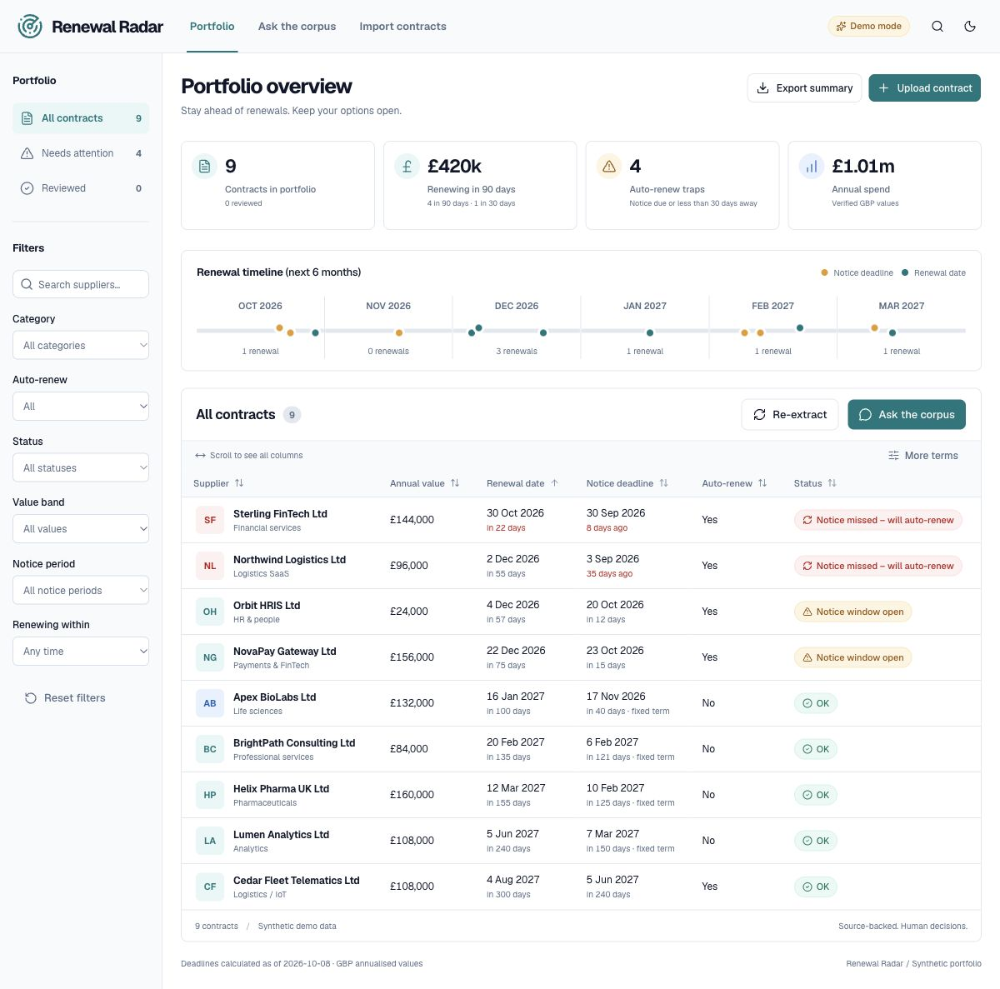
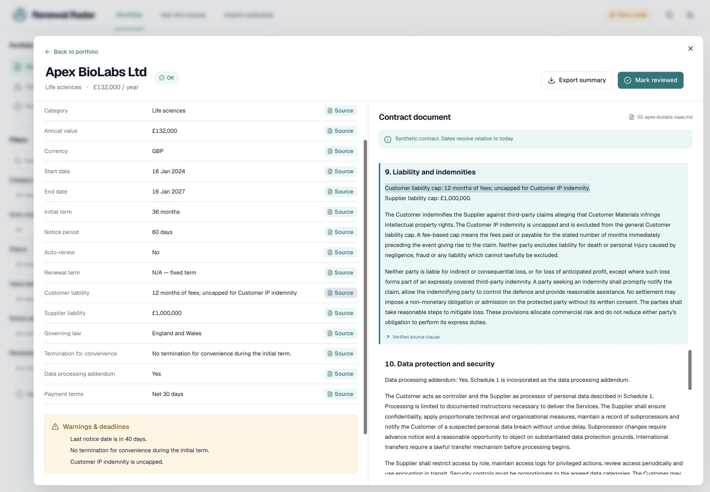
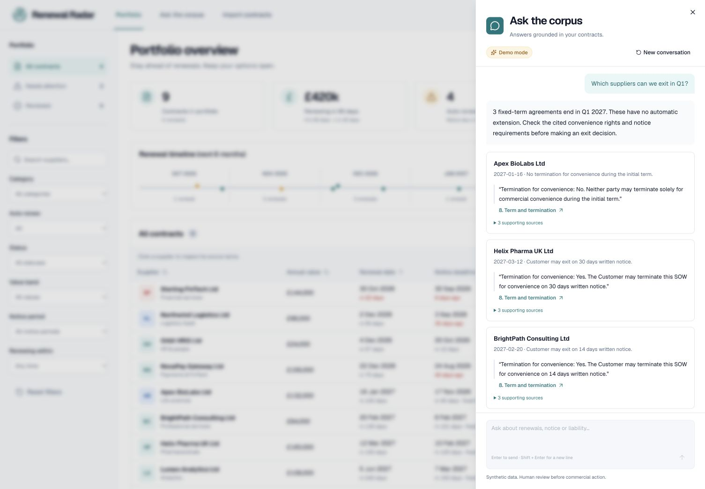
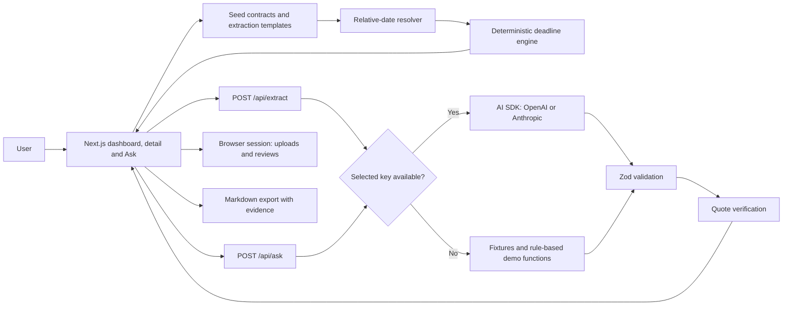

# Renewal Radar

Turn a folder of contracts into a renewals dashboard, verified key terms and source-cited answers.

  

**Live demo:** [Open Renewal Radar](https://renewal-radar-azure.vercel.app) · **Built by:** [Steve Grady](https://github.com/ZeroCool0388) · **LinkedIn:** [Steve on LinkedIn](https://www.linkedin.com/in/steve-jg)

**Source:** [ZeroCool0388/renewal-radar](https://github.com/ZeroCool0388/renewal-radar)



Works immediately without an API key. Nine substantial synthetic agreements demonstrate a £420k renewal horizon, a short-notice auto-renew trap and uncapped liability exceptions. Nothing is sent to an LLM in demo mode.

## Problem

Missed notice periods lock companies into another year of spend. Commercial terms are scattered across documents, so procurement teams struggle to see exit options, surprise renewals and liability exposure together. Finding the right clause should take seconds, and every answer should be auditable.

## What it does

- Extracts structured commercial terms with a verified quote for every stated field.
- Calculates deadlines in code, then surfaces notice risks in a filterable, sortable dashboard and six-month timeline.
- Answers portfolio questions with source quotations and clickable clause links; follow-ups keep session context.
- Ingests Markdown, text and text-based PDFs, with deterministic demo extraction or OpenAI/Anthropic generation.
- Supports reviewed flags, notes, a keyboard command palette and evidence-bearing Markdown exports.

## Demo

GIF placeholder: `docs/demo.gif` — see [recording notes](docs/DEMO.md).




**90-second walkthrough**

1. **0–10 s:** “Most companies find out they auto-renewed a vendor when the invoice arrives. This stops that.”
2. **10–25 s:** Point to annual spend, £420k ending within 90 days and the red/amber rows. Sterling's 30-day notice deadline is already past; the imminent renewal deserves immediate human review.
3. **25–45 s:** Open Apex BioLabs. Show its lack of a convenience exit and uncapped Customer IP indemnity. Click the Customer liability source and watch the clause highlight.
4. **45–70 s:** Ask “Which suppliers can we exit in Q1?” Show the cited fixed expiries and the distinction between expiry and a convenience exit. Follow Helix's termination citation into the document.
5. **70–90 s:** Filter Auto-renew to Yes and Notice period to Less than 60 days. Export the portfolio summary. Close on the cost of missing a single notice deadline.

Dates roll with the demo day, so Q1 matches and some spend figures change. The seeded notice traps stay visible.

## How to run

Use Node **20.19+**, or a current Node 22/24 LTS release.

```bash
npm install
npm run dev
```

Open the localhost URL printed by Next.js. No `.env` is required. For production locally:

```bash
npm run build
npm start
```

Checks:

```bash
npm run lint
npm run typecheck
npm run test
npm run eval
npx playwright install chromium
npm run test:e2e
```

The [CI workflow](.github/workflows/ci.yml) runs lint, typechecking, unit/API tests and a production build on every push and pull request.

Deploy by importing the repository into Vercel and accepting the detected Next.js settings. No database, storage service or extra Vercel configuration is needed. Leave API keys unset for the public demo. Both API routes use Node and the seeded `/data` files are explicitly included in the server bundle. The public demo is deployed as the separate `renewal-radar` project on Vercel Hobby, connected to this repository. Pushes to `main` trigger production deployments.

## Demo mode vs live mode

Copy `.env.example` to `.env.local` only when enabling a provider:

| Variable            | Purpose                                                                    |
| ------------------- | -------------------------------------------------------------------------- |
| `LLM_PROVIDER`      | `openai` or `anthropic`; otherwise an available key selects the provider   |
| `OPENAI_API_KEY`    | Server-only OpenAI credential                                              |
| `ANTHROPIC_API_KEY` | Server-only Anthropic credential                                           |
| `LLM_MODEL`         | Optional model override; defaults to `gpt-4.1-mini` or `claude-sonnet-4-5` |

Without the selected provider's key, the application uses demo mode. Seeded extraction templates load immediately. Demo re-extraction/uploads use a conservative rule extractor; starter Q&A fixtures supply intents and example sources, while matching, totals and dates are recomputed against the current portfolio. Free text uses supplier/category keywords and common supported predicates; unsupported questions suggest a narrower query. The demo extractor recognises labelled particulars and common renewal phrasing, not arbitrary legal language. Missing terms are explicitly shown as “Not found.”

With a key, an initial background extraction replaces the templates after successful live generation. Re-extract, uploads and Ask use the configured AI SDK provider and shared Zod schemas. Keys never reach the browser. Provider failures preserve the usable portfolio and offer “Continue in demo mode.” The badge reflects the currently active operation mode, and each chat turn records its own mode. Until initial live extraction succeeds, the portfolio truthfully shows Demo mode.

**Verification boundary:** demo workflows have been executed locally and on the public Vercel deployment; both provider adapter paths have automated mocked-generation tests. Real authenticated OpenAI/Anthropic calls have not been run because credentials are not available. The hosted dashboard, filters, cited Q&A, source highlighting, PDF extraction and Open Graph image have been verified in Demo mode.

## Architecture



`lib/schema.ts` is the shared contract. `lib/dates.ts` owns all deadline arithmetic. `lib/citations.ts` checks source existence before terms or answer matches are shown. Unverified fields become null; answer prose is withheld when any required match citation fails. Quotes are normalised conservatively for whitespace, case and typography. This verifies source existence, not legal interpretation or semantic entailment.

`lib/seeds.ts` loads the rolling fixtures. `lib/extractor.ts` provides the demo rule path. `lib/llm.ts` is the thin server-only provider adapter; no vector database is involved. Corpus Q&A receives verified extraction JSON, computed deadlines and relevant source excerpts. React components separate the dashboard shell, filters, metrics, timeline, table, detail, uploads and chat. TanStack Table handles sorting; Recharts renders the cumulative renewal-value sparkline.

Uploads, notes and review flags use `sessionStorage`, scoped to this browser tab/session. Chat context stays in React memory and resets on refresh. Seed dates refresh on reload; uploaded dates never move. Up to 25 contracts are supported, with at most 10 files and 4 MB total per upload. PDFs need extractable text, with citations retaining page numbers. No accounts, database, OCR, document editing or external reminders are included.

## Eval results

`npm run eval` runs 30 promptfoo cases from `evals/promptfooconfig.json` through `evals/run.ts`. The provider calls the demo extractor, deadline engine, citation checks and recorded Q&A fixtures. The clock is fixed at 2026-10-08. A provider key selects live mode and the run blocks that call. Promptfoo telemetry and sharing are disabled. The [eval workflow](.github/workflows/eval.yml) runs the same command on every push and pull request, with no secrets.

A local run passed **30/30** cases, a pass rate of 100.0%.

## Cost and latency

That run reported cost £0, `model_calls: 0` and `suite_latency_ms: 151.9`.

## MCP server

A local stdio server in `mcp/` exposes the same synthetic agreements to an MCP client. It lists agreements, reads one agreement, reports renewals and notice deadlines within N days, searches clauses, and answers from `data/qa-fixtures.json` with citations. It does not call a model or the network. Reads are the default. `add_note` and `flag_contract` write only to a gitignored demo file, and only after `request_write_approval` plus `confirm: true` for that exact call. Every call is appended to a local JSONL audit log with secret-shaped values redacted. Details and the Cursor snippet are in [mcp/README.md](mcp/README.md).

Example `.cursor/mcp.json`:

```json
{
  "mcpServers": {
    "renewal-radar": {
      "command": "uv",
      "args": ["--directory", "mcp", "run", "renewal-radar-mcp"]
    }
  }
}
```

Measured from `uv run pytest` in `mcp/` on Python 3.12.3: `37 passed in 1.55s`. That run includes the tool, approval, audit, and red-team tests.

## How deadlines are calculated

The deadline engine uses calendar days, not millisecond division:

- `noticeWindowOpensOn` is the End date minus the notice period. In this demo, that label is the **last date to deliver notice**, not the start of a legally guaranteed interval.
- `daysToNotice` and `daysToRenew` compare calendar dates to today. Negative values mean the date has passed.
- Missing end/notice/auto-renew terms produce **Needs review**.
- An end date before today produces **Expired**.
- An auto-renewing agreement whose notice deadline is **0–60 days away**, inclusive, produces **Notice window open**. There is still time to serve notice.
- An auto-renewing agreement whose notice deadline has **passed** produces **Notice missed – will auto-renew**. This takes priority even when renewal is within 30 days.
- Fixed-term agreements do not get either auto-renew notice status; otherwise the status is **OK**. Imminent dates still appear in the timeline and renewal-day counts.
- An auto-renew trap has a future/current renewal and a last notice date already passed or fewer than 30 days away.

Fixed-term expiries are never counted as auto-renew traps. The missed-notice label assumes no valid notice was served; confirm delivery and any amendments with a person before acting. The app cannot observe notices or infer that a past agreement actually renewed.

Northwind and Sterling always sit beyond their last notice dates; Sterling renews in 22 days. Orbit's notice deadline is 12 days away and NovaPay's is 15 days away, so both have open notice windows. Placeholders resolve in both the source text and extraction quotes before verification, keeping the demo fresh without inconsistent citations. Q1 means the current Q1 during January–March and the next Q1 otherwise. See [the full token convention](data/README.md).

## What I'd tell a customer

“Start with your top 50 vendors by spend. Give the team one clear view of the notice dates and exit options, with the actual clause one click away. Catching one unwanted annual renewal can justify a pilot; reducing the hours spent finding and checking clauses gives the team more time for supplier conversations.”

For a pilot, measure missed-deadline spend avoided, analyst hours saved per quarter and the percentage of extracted fields accepted by a human reviewer. These are measures to establish with the customer, not claimed results from this demo. Keep procurement and legal colleagues in control of notices and commercial decisions. Source citations make the review explainable and auditable.

## Roadmap

CLM and DocuSign integrations; controlled calendar reminders; multi-currency valuation; obligation tracking beyond renewals; commercial playbooks; a persistent review history; better extraction evaluation on approved synthetic corpora. Authentication, rate limits and storage would be needed before accepting real customer data or exposing a paid LLM publicly.

## Data & disclaimer

All seeded companies, customers, agreements, values and dates are fictional. Every source begins with an explicit synthetic-data notice. The included PDF is also synthetic. Use only synthetic uploads in this portfolio demo. The tool is a demonstration of workflow and source traceability, not a substitute for legal review. It does not send notices, sign contracts or make commercial decisions.

The original authoring brief remains in the local project folder and is excluded from Git and deployment. No credentials are committed. `.env*` files are ignored except the blank `.env.example` template.

## Licence

[MIT](LICENSE). Copyright © 2026 Steve Grady.
